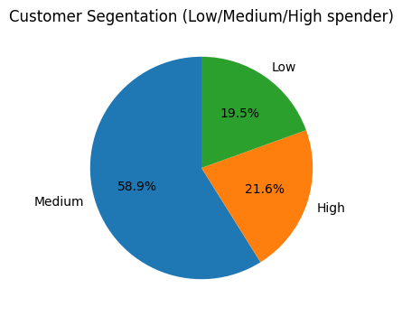
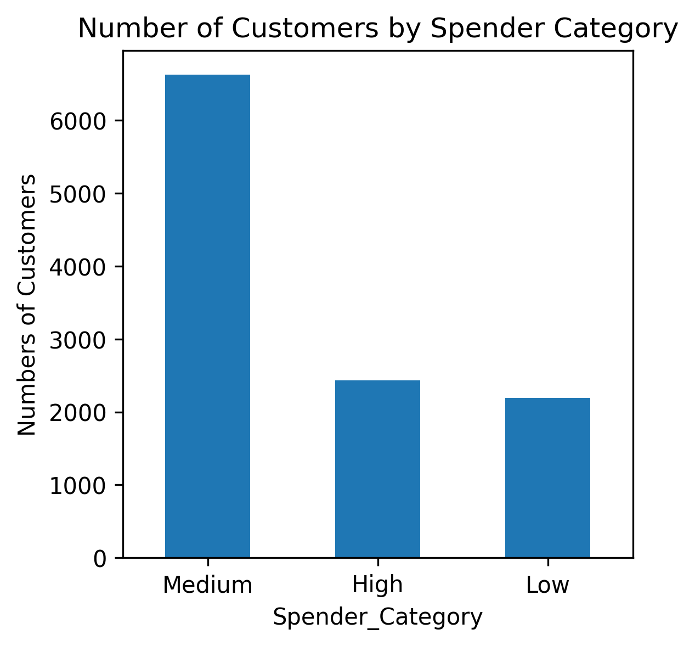
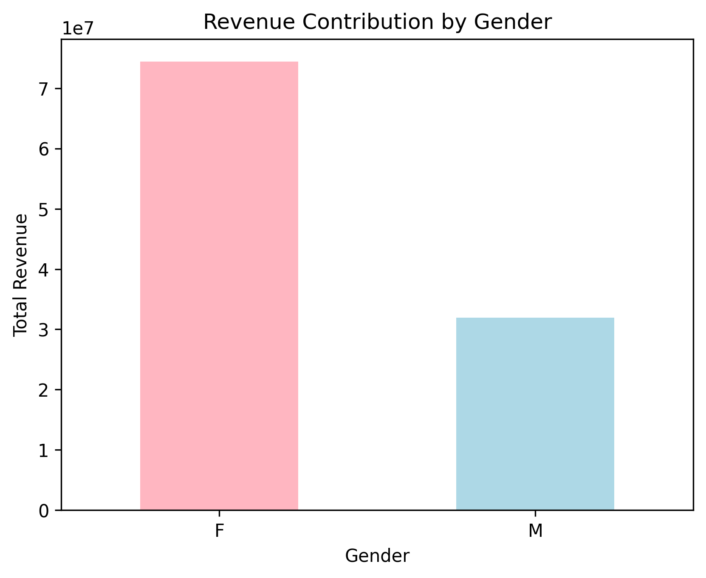
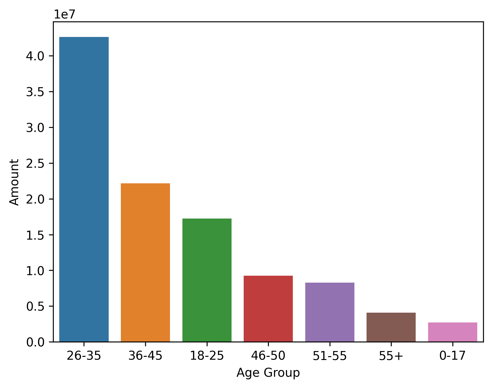
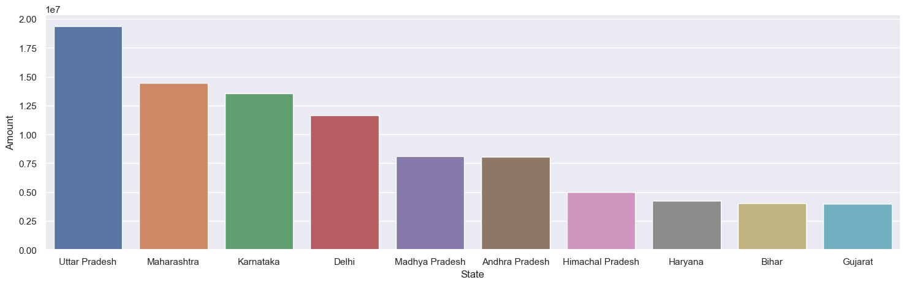
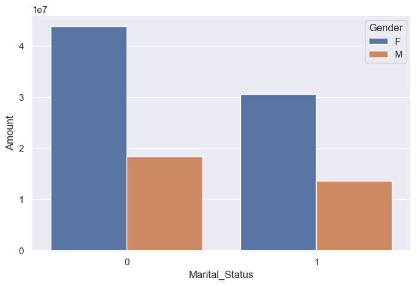
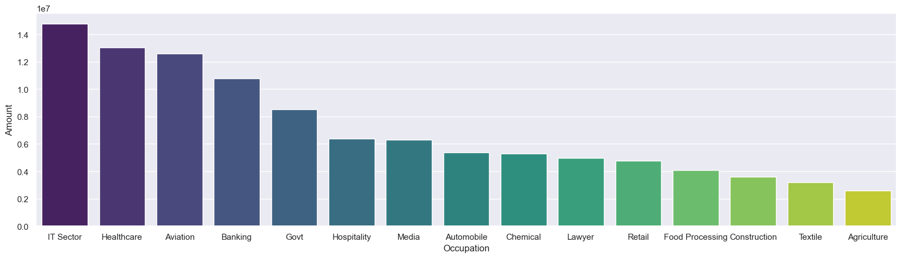
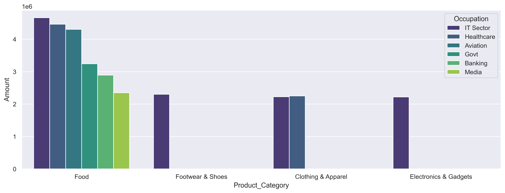

# 🎆Diwali Sales Data Analysis(EDA Project)

This project performs **Exploratory Data Analysis (EDA)** on Diwali Sales Data using Python.  
The goal is to analyze customer purchasing behavior, product performance, and sales trends.  

It is part of my **portfolio** and can also be used as an **interview showcase project**.

---

## 📌 Project Overview
- Loaded & cleaned sales dataset
- Performed data preprocessing using **Pandas** & **NumPy**
- Conducted **Exploratory Data Analysis (EDA)**
- Created **visualizations** with **Matplotlib** & **Seaborn**
- Generated **key business insights** to improve sales strategy
- Generated  **Business Recommendations**

---

## 📂 Dataset
- Dataset: `Diwali Sales Data.csv`  
- Contains sales records with customer demographics & purchase details.  
- Columns include:  
  `'User_ID', 'Customer_name', 'Product_ID', 'Gender', 'Age Group', 'Age',
       'Marital_Status', 'State', 'Zone', 'Occupation', 'Product_Category',
       'Orders', 'Amount', 'Total_spending', 'High_Spender',
       'Spender_Category'`

---
# Usage 
Run the jupyter notebook to explore the analysis

---
# Technologis used
- Jupyter Notebook:-For analysis & run
- Python
- Pandas:-For data cleaning,manipulation or analysis
- Numpy:-For numerical operation
- Matplotlib & Seaborn:-For Data Visualization

---

## Data Cleaning Performed

**Removed unnecessary columns**
  - Remove columns(status,unnamed1)<br>
**2.Checked missing values**
  - Found missing value in amount and handel them using fillna method with median imputation.<br>
**3.Add new columns**
  - Add new columns (Total_spending,High_Spender,Spender_Category)<br>
**4.Use level segmentation** 
  - Amount divied into level segmentation using conditional statement <br>
**5.Remove Whitespaces**  
  - Remove whitespaces using strip methods for spaces in columns and cell values.<br>
**6.Rename columns**
  - Rename the cust_name using rename method.<br>  

# EDA(Exploratory Data Analysis)  

## 1.which group of customers should we target more in Diwali sales?
used:-<br>
*Pie chart*:-For  Distribution of Spender category<br>
*Bar Chart*:- For Customer count in each category.<br>

Shows the percentage distribution<br>


Shows the actual customer count<br>

## Observation :<br>
**Medium Spender** 58.9%:-majority of customers belong to Medium Spender segment, providing a stable revenue base.<br>
**High Spender** 21.6%:-smaller number of customers, but contributing significantly to revenue.<br>
**Low Spender** 19.5%:-opportunity for targeted marketing and upselling to increase revenue.
## Overall Insights:
- Most revenue comes from Medium and High Spenders<br>
- There is a significant opportunity to increase revenue by converting Low Spenders into Medium/High Spenders<br>
- Medium Spenders form the backbone of stable sales during Diwali.
## Tips:
- Design festive offers and loyalty programs to encourage Medium and Low Spenders to spend more
- Target Low Spenders with promotions to convert them into higher spending segments.(ex:-offers/discounts/coupons)
- Focus marketing campaigns on High-value customers for maximizing revenue.(ex:-special ads, festive coupons, premium offers)

## 2.Which gender contributes more to overall revenue?
used:-<br>
bar chart:-shows absolute comparsion between male and female<br>

## Observation:<br>
- Female is contributing  more revenue than the other.<br>
## Overall ingights:
- The majority of sales revenue is driven by X gender ,showing a clear purchasing dominance.<br>
## Tips:
- Target Female with permium offers.<br>
- Create campaigns to increase purchases from the lower-contributing gender<br>RevenueContribution.png

## 3.Which age group contribute the maximum sales and how should we target them in diwali sales?
used:- bar chart<br>

## Obseravtions:<br>
- Most customers fall in  the **26-35** & **36-45** age groups.<br>
- very few customer  are in the age of **0-17** age group.<br>
## Overall insight:<br>
- Young customers (0–17) don’t purchase much directly → spending depends on parents.<br>
- Senior customers (55+) are less active in online shopping → hence lower contribution.<br>
# Tips:<br>
- Focus marketing efforts on 25–44 age range with premium and festive offers.
- For 55+, provide simple UI, senior discounts, and health/wellness product deals
- Indirectly target 0–17 through parents with attractive kids/family bundles.
## 4.Which top 10 Contribute the most to overall sales during the diwali sales?<br>
used:-bar chart<br>

## Observation:<br>
- Uttar Pradesh  lead with highest sales contribution<br>
- Maharashtra, Karnataka, and Delhi also performed strongly
- States like Bihar, Gujarat, and Haryana contributed relatively less compared to top states.
## Overall insight:<br>
- Northern and Southern states dominate sales, showing strong consumer purchasing power.
- Urbanization and higher disposable(Extra saving) income play a major role in boosting sales in top states.
##Tips:
- Invest more in marketing campaigns and discount offers in states like UP, Maharashtra, and Karnataka to further maximize revenue.
- Strengthen delivery networks & warehouses in high-sales states to improve customer satisfaction.
- Launch localized offers and ads for states with lower sales to tap into untapped markets(exopler more lower city).
## 5.How does marital status affect customer spending during the Diwali sale?
used:- Bar chart<br>



## Observation:
- Unmarried females (Marital_Status = 0, Gender = F) have the highest spending.
-Married females also contribute significantly but lower than unmarried females.
-Male customers, both married and unmarried, spend much less compared to females.
## Overall insight:
- Female customers dominate sales across both marital status categories
- Male contribution to sales is consistently lower, showing a clear gender-based spending gap.
## Tips:
- Create exclusive festive bundles or discounts targeting women shoppers.
- Encourage male participation through couple/family-oriented promotions or special men’s product deals.
## Which occupations contribute the highest to overall sales?
used:bar chart<br>

## Observation:
- IT Sector customers spend the most, followed by Healthcare and Aviation.
- Agriculture, Textile, and Construction sectors spend the least among all.
## Overall insight:
- The top 3 occupations (IT, Healthcare, Aviation) account for the majority of spending.
- Agriculture, Textile, and Construction sectors are significantly underperforming.
- This suggests that certain professions (like IT & Healthcare) have higher disposable income and willingness to spend compared to others
## Tips
- Prioritize IT, Healthcare, and Aviation professionals for premium products, loyalty programs, and targeted campaigns.
- Offer exclusive deals or EMI options for Banking and Govt employees to increase mid-range spending
- Design affordable packages, seasonal discounts, or installment plans for low-spending groups like Agriculture, Textile, and Construction to improve their participation.
- Leverage data-driven campaigns (occupation-based personalized ads) to maximize ROI.
## Which occupation contributes the most to product sales?
used:-bar chart<br>

## Observation:
- People from the IT Sector spend the most, especially in Food, Clothing & Apparel, and Electronics & Gadgets.
- Healthcare professionals also contribute significantly, mostly in Food and Clothing & Apparel
- Occupations like Banking, Govt, and Media spend less compared to IT and Healthcare.
- Food category dominates across almost all occupations.
## Overall insight:
- The Food category is the highest contributor regardless of occupation.
- IT professionals are the top spenders across multiple product categories
- Occupations like Govt and Media show limited spending, suggesting low engagement in premium categories.
##Tips:
- Launch exclusive offers for IT and Healthcare professionals, as they are high-value customers
- For Govt and Media sectors, use targeted discounts to increase participation in categories like Clothing and Electronics.
- Continue strengthening the Food category, as it is the most attractive across all occupations
- Introduce bundle offers (Food + Electronics / Food + Apparel) for IT and Healthcare employees to increase cross-category sales.


```bash
git clone https://github.com/AshaKumari34/Diwali_sales.git
cd diwali-sales-analysis
pip install -r requirements.txt